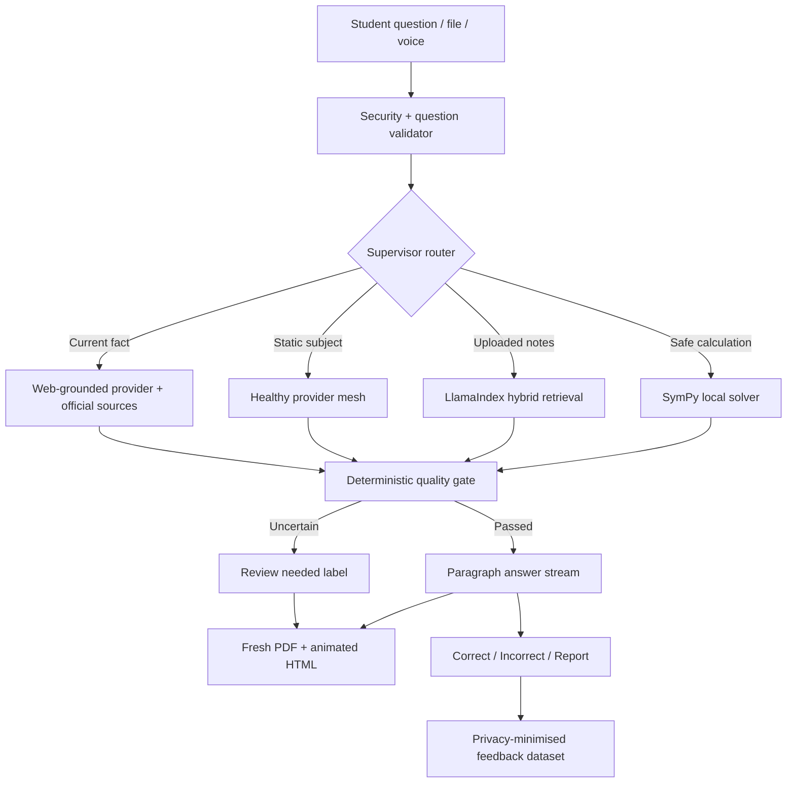

# Exam Saathi v6.0.0 Architecture

## Cache rule

Only stable answers that passed a verification gate may be cached. Cache keys
include normalized full question, language, subject and engine version. Current,
high-risk and web-required questions are never cached.

## Monitoring rule

Structured logs exclude raw questions, answers and keys. LangSmith remains
optional and hides student input/output unless an administrator explicitly
changes that privacy setting.
